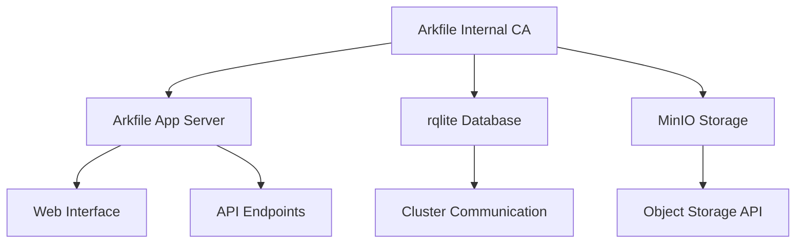

# TLS Configuration Guide

## Overview

Arkfile implements modern TLS certificate management with enterprise-grade security features. This guide covers TLS certificate generation, management, and production deployment strategies.

## Table of Contents

1. [Quick Start](#quick-start)
2. [Certificate Architecture](#certificate-architecture)
3. [Modern Cryptographic Standards](#modern-cryptographic-standards)
4. [Certificate Generation](#certificate-generation)
5. [Certificate Management](#certificate-management)
6. [Production Deployment](#production-deployment)
7. [Security Best Practices](#security-best-practices)
8. [Troubleshooting](#troubleshooting)
9. [Emergency Procedures](#emergency-procedures)

## Quick Start

### Generate Development Certificates

```bash
# 1. Set up infrastructure (if not already done)
sudo ./scripts/setup-users.sh
sudo ./scripts/setup-directories.sh

# 2. Generate modern TLS certificates
sudo ./scripts/setup-tls-certs.sh

# 3. Validate certificates
./scripts/validate-certificates.sh

# 4. View certificate details
./scripts/validate-certificates.sh --details
```

### Production Domain Setup

```bash
# Set domain for production certificates
export ARKFILE_DOMAIN=yourdomain.com

# Generate certificates with proper domain
sudo -E ./scripts/setup-tls-certs.sh

# For production, use Let's Encrypt instead
sudo ./scripts/setup-letsencrypt.sh  # (when available)
```

## Certificate Architecture

### Directory Structure

```
/opt/arkfile/etc/keys/tls/
├── ca/                          # Certificate Authority
│   ├── ca-key.pem              # CA private key (ECDSA P-384)
│   ├── ca-cert.pem             # Self-signed CA certificate
│   └── ca-serial.txt           # Certificate serial tracking
├── arkfile/                     # Main application
│   ├── server-key.pem          # Server private key
│   ├── server-cert.pem         # Server certificate
│   └── server-bundle.pem       # Certificate + CA bundle
├── rqlite/                      # Database cluster
│   ├── server-key.pem          # rqlite TLS key
│   ├── server-cert.pem         # rqlite TLS certificate
│   └── server-bundle.pem       # Full certificate chain
├── minio/                       # Object storage
│   ├── server-key.pem          # MinIO TLS key
│   ├── server-cert.pem         # MinIO TLS certificate
│   └── server-bundle.pem       # Full certificate chain
├── backup/                      # Certificate backups
│   └── YYYYMMDD_HHMMSS/        # Timestamped backups
└── metadata.json               # Certificate metadata
```

### Certificate Hierarchy



## Modern Cryptographic Standards

### Algorithm Selection (2025 Standards)

**Primary (Recommended):**
- **Key Algorithm**: ECDSA P-384 (secp384r1)
- **Signature Algorithm**: ECDSA-SHA384
- **Key Exchange**: ECDH P-384
- **Cipher Suites**: TLS 1.3 preferred

**Fallback (Compatibility):**
- **Key Algorithm**: RSA 4096-bit
- **Signature Algorithm**: RSA-PSS-SHA384
- **Key Exchange**: DHE 4096-bit
- **Cipher Suites**: TLS 1.2 minimum

### Certificate Extensions

All certificates include modern security extensions:

```
Basic Constraints: CA:FALSE (for service certs)
Key Usage: Digital Signature, Key Encipherment, Key Agreement
Extended Key Usage: Server Authentication, Client Authentication
Subject Alternative Name: Multiple domains and IP addresses
Subject Key Identifier: Hash-based identifier
Authority Key Identifier: CA chain validation
```

### TLS Protocol Configuration

**Supported Protocols:**
- TLS 1.3 (preferred)
- TLS 1.2 (minimum)

**Cipher Suite Priorities:**
```
# TLS 1.3 (preferred)
TLS_AES_256_GCM_SHA384
TLS_CHACHA20_POLY1305_SHA256
TLS_AES_128_GCM_SHA256

# TLS 1.2 (fallback)
ECDHE-ECDSA-AES256-GCM-SHA384
ECDHE-RSA-AES256-GCM-SHA384
ECDHE-ECDSA-CHACHA20-POLY1305
```

## Certificate Generation

### Initial Setup

```bash
# Generate all certificates with modern algorithms
sudo ./scripts/setup-tls-certs.sh

# Check generation status
echo $?  # 0 = success, non-zero = issues
```

### Custom Configuration

```bash
# Use RSA instead of ECDSA
export ARKFILE_TLS_ALGORITHM=rsa
sudo -E ./scripts/setup-tls-certs.sh

# Custom domain
export ARKFILE_DOMAIN=internal.company.com
sudo -E ./scripts/setup-tls-certs.sh

# Custom validity period (default: 365 days)
# Edit scripts/setup-tls-certs.sh: VALIDITY_DAYS=730
```

### Certificate Features

**Subject Alternative Names (SAN):**
- Primary domain: `arkfile.yourdomain.com`
- Fallback: `yourdomain.com`
- Local development: `localhost`
- Internal DNS: `arkfile.internal`
- IP addresses: `127.0.0.1`, `::1`

**Security Features:**
- Perfect Forward Secrecy (PFS)
- Certificate Transparency (CT) compatibility
- OCSP Must-Staple (for production)
- Certificate Authority Authorization (CAA) support

## Certificate Management

### Validation and Monitoring

```bash
# Comprehensive certificate validation
./scripts/validate-certificates.sh

# Detailed certificate information
./scripts/validate-certificates.sh --details

# Check specific service
openssl x509 -in /opt/arkfile/etc/keys/tls/arkfile/server-cert.pem -noout -text
```

### Certificate Renewal

```bash
# Automatic renewal (checks expiration)
./scripts/renew-certificates.sh

# Force renewal of all certificates
./scripts/renew-certificates.sh --force

# Custom warning threshold (default: 30 days)
./scripts/renew-certificates.sh --warning-days 7
```

### Backup and Recovery

```bash
# Manual backup
sudo ./scripts/backup-keys.sh

# Backup locations
ls -la /opt/arkfile/etc/keys/tls/backup/

# Recovery from backup
sudo cp -r /opt/arkfile/etc/keys/tls/backup/YYYYMMDD_HHMMSS/* /opt/arkfile/etc/keys/tls/
sudo systemctl restart arkfile minio@arkfile rqlite@arkfile
```

## Production Deployment

### Let's Encrypt Integration

For production deployments, use Let's Encrypt certificates:

**Option 1: Automated Setup (Recommended)**
```bash
# Install certbot and configure
sudo ./scripts/setup-letsencrypt.sh
```

**Option 2: Manual Certbot**
```bash
# Install certbot
sudo apt install certbot

# Generate ECDSA certificate
sudo certbot certonly --webroot \
  --webroot-path /var/www/html \
  --email admin@yourdomain.com \
  --agree-tos \
  --key-type ecdsa \
  --elliptic-curve secp384r1 \
  -d yourdomain.com \
  -d www.yourdomain.com
```

### Production Certificate Locations

**Let's Encrypt certificates:**
```
/etc/letsencrypt/live/yourdomain.com/
├── privkey.pem         # Private key
├── cert.pem            # Certificate
├── chain.pem           # Certificate chain
└── fullchain.pem       # Full certificate chain
```

**Application configuration:**
```yaml
# config/prod.yaml
tls:
  cert_file: "/etc/letsencrypt/live/yourdomain.com/fullchain.pem"
  key_file: "/etc/letsencrypt/live/yourdomain.com/privkey.pem"
  ca_file: "/etc/ssl/certs/ca-certificates.crt"
```

### Automated Renewal

**Certbot automatic renewal:**
```bash
# Add to crontab
0 12 * * * /usr/bin/certbot renew --quiet --post-hook "systemctl reload arkfile caddy"
```

**Custom renewal monitoring:**
```bash
# Add to crontab for monitoring
0 9 * * 1 /opt/arkfile/scripts/validate-certificates.sh --warning-days 7
```

## Security Best Practices

### Certificate Security

1. **Private Key Protection**
   - Keys stored with 600 permissions
   - Owned by arkfile:arkfile
   - Never logged or exposed in error messages

2. **Certificate Validation**
   - Regular expiration monitoring
   - Automated renewal processes
   - Certificate chain validation
   - OCSP stapling enabled

3. **Transport Security**
   - TLS 1.3 preferred, TLS 1.2 minimum
   - Strong cipher suites only
   - Perfect Forward Secrecy (PFS)
   - HSTS headers enabled

### Network Security

**Firewall Configuration:**
```bash
# Allow HTTPS traffic
sudo ufw allow 443/tcp

# Block direct access to internal services
sudo ufw deny 9000/tcp  # MinIO
sudo ufw deny 4001/tcp  # rqlite
```

**Caddy Configuration (Reverse Proxy):**
```caddyfile
yourdomain.com {
    reverse_proxy localhost:8080
    
    # Security headers
    header {
        Strict-Transport-Security "max-age=31536000; includeSubDomains"
        X-Content-Type-Options "nosniff"
        X-Frame-Options "DENY"
        X-XSS-Protection "1; mode=block"
    }
    
    # TLS configuration
    tls {
        protocols tls1.2 tls1.3
        ciphers TLS_AES_256_GCM_SHA384 TLS_CHACHA20_POLY1305_SHA256
    }
}
```

### Monitoring and Alerting

**Certificate Expiration Monitoring:**
```bash
#!/bin/bash
# /opt/arkfile/scripts/monitor-certificates.sh

WEBHOOK_URL="https://hooks.slack.com/your-webhook"
WARNING_DAYS=30

if ! ./scripts/validate-certificates.sh --warning-days $WARNING_DAYS; then
    curl -X POST -H 'Content-type: application/json' \
        --data '{"text":"⚠️ Arkfile certificates expiring soon!"}' \
        $WEBHOOK_URL
fi
```

## Troubleshooting

### Common Issues

**OpenSSL 3.x Compatibility:**
```bash
# Error: "Unknown cipher: pkcs8"
# Solution: Update to modern OpenSSL syntax (already fixed in scripts)

# Check OpenSSL version
openssl version

# Test ECDSA support
openssl ecparam -list_curves | grep secp384r1
```

**Certificate Validation Failures:**
```bash
# Debug certificate issues
openssl x509 -in /path/to/cert.pem -noout -text
openssl verify -CAfile /path/to/ca.pem /path/to/cert.pem

# Check certificate-key pair
openssl x509 -in cert.pem -pubkey -noout | openssl sha256
openssl pkey -in key.pem -pubout | openssl sha256
```

**Service TLS Issues:**
```bash
# Test TLS connection
openssl s_client -connect localhost:443 -servername yourdomain.com

# Check certificate chain
openssl s_client -connect yourdomain.com:443 -showcerts
```

### Log Analysis

**Certificate-related logs:**
```bash
# Arkfile application logs
journalctl -u arkfile -f | grep -i tls

# Certificate generation logs
tail -f /var/log/arkfile/tls-setup.log

# System certificate store
update-ca-certificates --verbose
```

### Performance Issues

**Certificate Loading:**
```bash
# Benchmark certificate operations
time openssl x509 -in cert.pem -noout -text
time openssl verify -CAfile ca.pem cert.pem

# Monitor certificate-related CPU usage
htop -u arkfile
```

## Emergency Procedures

### Certificate Compromise

**Immediate Response:**
```bash
# 1. Revoke compromised certificates (if using public CA)
sudo certbot revoke --cert-path /path/to/compromised/cert.pem

# 2. Generate new certificates immediately
sudo ./scripts/setup-tls-certs.sh --force

# 3. Restart all services
sudo systemctl restart arkfile minio@arkfile rqlite@arkfile caddy

# 4. Update certificate pinning (if used)
# 5. Notify users of potential security issue
```

### Certificate Expiration Emergency

**Expired Certificate Recovery:**
```bash
# 1. Generate emergency certificates
export ARKFILE_TLS_ALGORITHM=rsa  # Faster generation
sudo -E ./scripts/setup-tls-certs.sh

# 2. Restart services immediately
sudo systemctl restart arkfile

# 3. Schedule proper renewal
./scripts/renew-certificates.sh --force
```

### Rollback Procedures

**Certificate Rollback:**
```bash
# 1. Stop services
sudo systemctl stop arkfile minio@arkfile rqlite@arkfile

# 2. Restore from backup
sudo cp -r /opt/arkfile/etc/keys/tls/backup/LATEST/* /opt/arkfile/etc/keys/tls/

# 3. Validate restored certificates
./scripts/validate-certificates.sh

# 4. Restart services
sudo systemctl start arkfile minio@arkfile rqlite@arkfile
```

## Configuration Examples

### Development Environment

```bash
# Quick development setup
export ARKFILE_DOMAIN=localhost
export ARKFILE_TLS_ALGORITHM=ecdsa
sudo -E ./scripts/setup-tls-certs.sh
```

### Staging Environment

```bash
# Staging with custom domain
export ARKFILE_DOMAIN=staging.yourdomain.com
export ARKFILE_TLS_ALGORITHM=ecdsa
sudo -E ./scripts/setup-tls-certs.sh

# Add staging CA to trust store for testing
sudo cp /opt/arkfile/etc/keys/tls/ca/ca-cert.pem /usr/local/share/ca-certificates/arkfile-staging.crt
sudo update-ca-certificates
```

### Production Environment

```bash
# Production with Let's Encrypt
sudo ./scripts/setup-letsencrypt.sh

# Or use existing certificates
sudo ./scripts/import-production-certs.sh \
  --cert /path/to/production.crt \
  --key /path/to/production.key \
  --ca /path/to/ca-bundle.crt
```

## Support and Resources

### Command Reference

| Command | Purpose |
|---------|---------|
| `./scripts/setup-tls-certs.sh` | Generate all TLS certificates |
| `./scripts/validate-certificates.sh` | Validate and check certificates |
| `./scripts/renew-certificates.sh` | Renew expiring certificates |
| `./scripts/backup-keys.sh` | Backup all cryptographic keys |
| `./scripts/emergency-procedures.sh` | Emergency recovery procedures |

### Environment Variables

| Variable | Default | Purpose |
|----------|---------|---------|
| `ARKFILE_DOMAIN` | `localhost` | Primary domain for certificates |
| `ARKFILE_TLS_ALGORITHM` | `ecdsa` | Preferred algorithm (ecdsa/rsa) |

### File Locations
