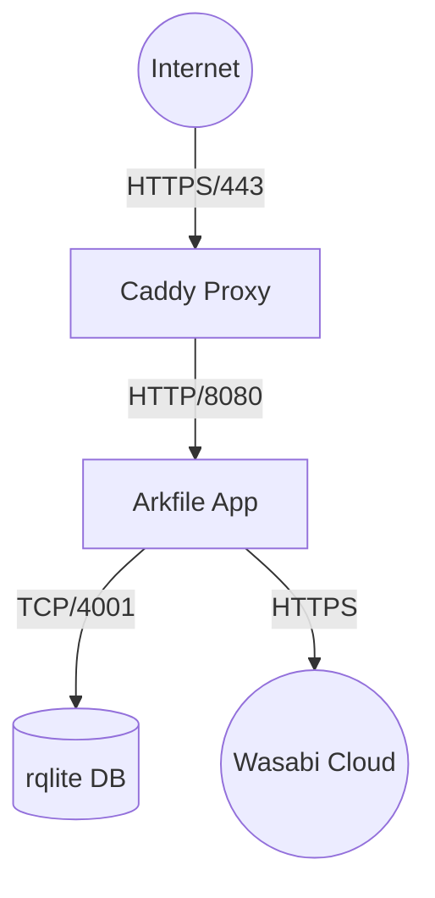

# Arkfile Container Deployment Guide (Podman + Scratch)

## 1. Philosophy: "The Void"

This deployment strategy is designed for **maximum security** and **minimal footprint**. It adheres to the following principles:

1.  **No Distro (Scratch):** The application containers (Arkfile, rqlite) contain *only* the binary and the absolute minimum system files (certs, timezone, user). There is no shell, no package manager, and no operating system to exploit.
2.  **Rootless (Podman):** All containers run as a non-root user on the host. Even if a container is compromised, the attacker gains no privileges on the host system.
3.  **Daemonless:** We use Podman, which requires no central root daemon running in the background.
4.  **Separation of Concerns:** Each component (App, DB, Proxy) runs in its own isolated container.

## 2. Why Podman?

We choose Podman over Docker for this deployment for specific security reasons:

*   **Rootless by Default:** Docker defaults to running as root. Podman defaults to running as your user. This drastically reduces the blast radius of a container breakout.
*   **Daemonless:** Docker requires `dockerd` to be running as root. Podman spawns containers as child processes of your user session.
*   **Systemd Integration:** Podman can generate systemd unit files (`podman generate systemd`), allowing your containers to be managed like standard Linux services (start on boot, restart on failure, logs via journald).

## 3. Architecture

For a production deployment using **Wasabi Cloud Storage**, the fleet consists of **3 Containers**:



*   **Caddy:** The only container exposing ports (80/443) to the host. Handles TLS termination.
*   **Arkfile:** Runs in a private internal network. No ports exposed to host.
*   **rqlite:** Runs in a private internal network. No ports exposed to host.

## 4. Container Specifications

### A. Arkfile (The App) - `FROM scratch`

We use a **3-Stage Build** to create a container with *zero* OS files.

```dockerfile
# --- STAGE 1: Builder ---
# Use the latest Go version to compile
FROM golang:1.25-alpine AS builder
WORKDIR /src
COPY . .
# Build static binary (CGO_ENABLED=0 is critical for scratch)
RUN CGO_ENABLED=0 go build -ldflags="-s -w" -o /arkfile ./main.go

# --- STAGE 2: Harvester ---
# Use Alpine to grab the system files we need
FROM alpine:latest AS harvester
RUN apk add --no-cache ca-certificates tzdata
# Create a non-root user 'arkfile' (uid 1000)
RUN echo "arkfile:x:1000:1000:arkfile:/:" > /etc/passwd_minimal

# --- STAGE 3: Final (The Void) ---
FROM scratch

# 1. Copy the Binary
COPY --from=builder /arkfile /bin/arkfile

# 2. Copy Essentials (Certs for HTTPS, Timezone for TOTP/JWT)
COPY --from=harvester /etc/ssl/certs/ca-certificates.crt /etc/ssl/certs/
COPY --from=harvester /usr/share/zoneinfo /usr/share/zoneinfo

# 3. Copy User Info
COPY --from=harvester /etc/passwd_minimal /etc/passwd

# Security: Run as unprivileged user
USER 1000

# Config: Expose internal port
EXPOSE 8080

ENTRYPOINT ["/bin/arkfile"]
```

### B. rqlite (The DB) - `FROM scratch`

Similar strategy for the database.

```dockerfile
# --- STAGE 1: Builder ---
FROM golang:1.25-alpine AS builder
WORKDIR /src
RUN apk add --no-cache git
RUN git clone https://github.com/rqlite/rqlite.git .
# Build static binary
RUN CGO_ENABLED=0 go build -ldflags="-s -w" -o /rqlited ./cmd/rqlited

# --- STAGE 2: Harvester ---
FROM alpine:latest AS harvester
RUN apk add --no-cache ca-certificates tzdata
RUN echo "rqlite:x:1000:1000:rqlite:/:" > /etc/passwd_minimal

# --- STAGE 3: Final ---
FROM scratch
COPY --from=builder /rqlited /bin/rqlited
COPY --from=harvester /etc/passwd_minimal /etc/passwd
COPY --from=harvester /etc/ssl/certs/ca-certificates.crt /etc/ssl/certs/
COPY --from=harvester /usr/share/zoneinfo /usr/share/zoneinfo

USER 1000
EXPOSE 4001 4002
ENTRYPOINT ["/bin/rqlited"]
CMD ["-http-addr", "0.0.0.0:4001", "-raft-addr", "0.0.0.0:4002", "/data"]
```

### C. Caddy (The Proxy) - `caddy:alpine`

For Caddy, we use the official Alpine-based image. While not `scratch`, it is extremely minimal.
*   **Why not scratch?** Caddy can be built from scratch, but the Alpine image provides useful debugging tools if network issues arise, and the attack surface is still very small.
*   **Note:** If "No Debian" is a hard rule, `caddy:alpine` satisfies this (it uses Alpine Linux, not Debian).

## 5. Orchestration (`compose.yaml`)

We use Docker Compose (compatible with Podman) to tie it all together.

```yaml
services:
  # --- 1. The Proxy ---
  caddy:
    image: caddy:alpine
    ports:
      - "80:80"
      - "443:443"
    volumes:
      - ./Caddyfile:/etc/caddy/Caddyfile
      - caddy_data:/data
      - caddy_config:/config
    networks:
      - arkfile_net
    restart: always

  # --- 2. The Database ---
  rqlite:
    build:
      context: .
      dockerfile: Dockerfile.rqlite
    volumes:
      - rqlite_data:/data
    networks:
      - arkfile_net
    restart: always

  # --- 3. The App ---
  arkfile:
    build:
      context: .
      dockerfile: Dockerfile
    environment:
      - STORAGE_PROVIDER=wasabi
      - S3_ENDPOINT=s3.wasabisys.com
      - DB_HTTP_ADDR=rqlite:4001
      # ... other secrets ...
    networks:
      - arkfile_net
    depends_on:
      - rqlite
    restart: always

  # --- 4. Optional: Local MinIO ---
  # Only starts if you run: docker compose --profile local-storage up
  minio:
    image: minio/minio:latest
    profiles: ["local-storage"]
    command: server /data
    volumes:
      - minio_data:/data
    networks:
      - arkfile_net

networks:
  arkfile_net:
    driver: bridge
    internal: false # Needs external access for Caddy, but internal for others

volumes:
  caddy_data:
  caddy_config:
  rqlite_data:
  minio_data:
```

## 6. Deployment with Podman

### Prerequisites
1.  Install Podman: `sudo apt install podman` (or `dnf install podman`)
2.  Install Podman Compose (or `docker-compose`):
    *   Modern Podman (v4.1+) works with standard `docker-compose`.
    *   Enable the socket: `systemctl --user enable --now podman.socket`
    *   Point Compose to it: `export DOCKER_HOST=unix://$XDG_RUNTIME_DIR/podman/podman.sock`

### Running the Stack
```bash
# Build and Start (Wasabi Mode)
podman-compose up -d --build

# Build and Start (Local Storage Mode)
podman-compose --profile local-storage up -d --build
```

### Generating Systemd Services
To make it robust (auto-start on boot):

```bash
# Generate unit files for the running pod
podman generate systemd --new --name arkfile_pod --files

# Install them to your user systemd directory
mv *.service ~/.config/systemd/user/

# Enable them
systemctl --user daemon-reload
systemctl --user enable --now pod-arkfile_pod.service
